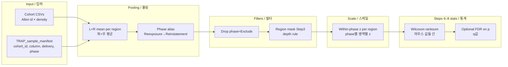
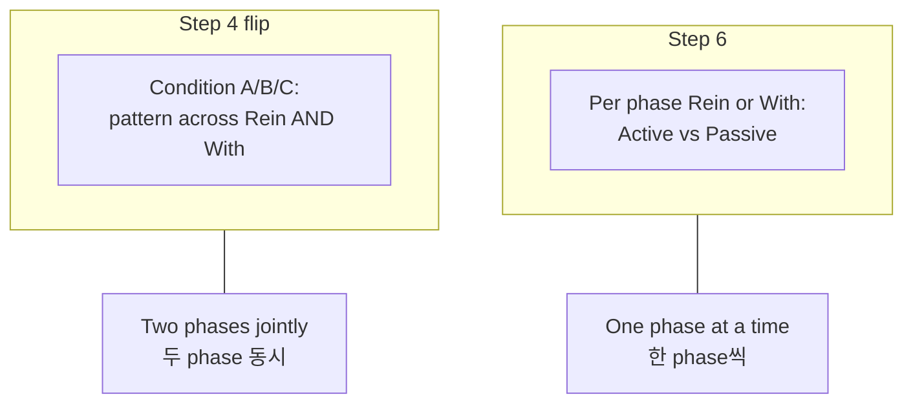

# TRAP pipeline — data processing, comparisons & statistics  
# TRAP 파이프라인 — 데이터 처리, 비교 방식, 통계

Bilingual reference for **README / GitHub**.  
README·GitHub용 **처리·비교·통계** 요약 (영문 + 한국어).

---

## 1. Schematic (flow) / 개요도

### Step 4 vs Step 6 — different questions are OK / 질문이 달라도 됨

**EN:** Step **6** asks: *within one phase (Rein **or** With), do Active and Passive differ per region?*  
Step **4** (Conditions A/B/C) asks: *does each region show a **combined pattern** across Rein **and** With (e.g. opposite A−P signs)?*  
Those are **different scientific questions**. **Top-region lists do not need to overlap** — that is expected, not an error. What we **align** across the pipeline is **data handling** (same mice if you use `manifest`, same z-scale option, same region mask where applicable), not the **ranking** of regions.

**KR:** Step **6**은 *한 phase(Rein **또는** With) 안에서* 영역별 Active vs Passive인지 묻고, Step **4**는 *Rein·With **동시에** 만족하는 패턴(예: A−P 부호 반대)*을 봅니다. **질문이 다르므로 상위 영역 목록이 겹치지 않아도 정상**입니다. 맞추는 것은 **입력·스케일·영역 마스크**이지, **같은 Top 50을 기대하는 것**은 아닙니다.

---

## 2. English — data processing

| Stage | What we do |
|-------|------------|
| **Cohort CSVs** | Each file: rows = Allen structures (`id`, `acronym`, …), columns = sample density (cells/mm³). All cohort files must share the same `id` list. |
| **Manifest** | Maps each included sample to `cohort_id` + `column_name`, `delivery` (Active/Passive), `phase` (Reinstatement, Withdrawal, …). `include=0` drops the sample. |
| **Bilateral pooling** | For paired `-L`/`-R` regions, one value per region = **(Left + Right) / 2** per mouse (`trap_load_pooled_density_LR`). |
| **Phase normalization** | Manifest label **Reexposure** is treated as **Reinstatement** for pooling. |
| **Exclude samples** | Rows with `phase=Exclude` are removed before Steps 6–9 (optional; matches Step 3 manifest workflow). |
| **Region subset** | Steps 6–9 can restrict to the **same depth/hierarchy** as Step 3 (`hierarchy567` or `depth56_fixed`). |
| **Step 9 (optional)** | Same as 6–8 but drops **cerebellum + brainstem** (keeps cerebrum, thalamus, hypothalamus). |
| **Z-score vs raw (Steps 6–10)** | Steps **6–9** and **10** write **two parallel trees**: **`raw_cells_mm3/`** (cells/mm³) and **`z_within_phase/`** (within-phase z per region across mice — same convention as Step 3 rep-region z). `phase_AP_z_within_phase` does **not** select a single tree. Cohort CSVs stay raw; four-way figures still include **both** raw and z panels where applicable. |

---

## 3. English — comparisons & statistics

| Analysis | Comparison | Statistic |
|----------|------------|-----------|
| **Step 1 BRANCH** | Active vs Passive **across all phases mixed** (and other global views) | Various (means, bootstrap, trees, PCA/UMAP on raw or filtered matrix — see Step 1 scripts). |
| **Step 2** | Correlations between samples / conditions | Correlation matrices / heatmaps. |
| **Step 3 v2** | Samples embedded (e.g. PCA/k-means); **representative regions** per cluster | Clustering silhouette; **within-phase z** plots for Active vs Passive side-by-side. |
| **Step 4 flip** | **Condition A/B/C**: e.g. Reinstatement (A−P) and Withdrawal (A−P) must satisfy a **joint sign/magnitude pattern** | Region lists + permutation-style summaries; **not** the same ranking as single-phase A vs P. |
| **Steps 6–7** | **Within Reinstatement only** or **within Withdrawal only**: Active mice vs Passive mice **per region** | **Wilcoxon rank-sum (`ranksum`)** on **all mouse values** (one dot per mouse). With z-scale on, ranks (and thus **p-values**) match raw-scale ranksum per region; means/figures are in **z**. Optional **FDR** (Benjamini–Hochberg/BY) across regions. |
| **Step 8** | Same delivery (Active **or** Passive): **Reinstatement mice vs Withdrawal mice** per region | **Wilcoxon rank-sum** on mouse-level values; use **`z_within_phase/`** or **`raw_cells_mm3/`** folder for axis units. |
| **Step 6b screening** | How much **(A−P) in Rein** differs from **(A−P) in With** per region | **\|d_Rein − d_With\|** under each scale folder (exploratory; not a formal interaction test per region). |

**Aligning Step 3 and Steps 6–9:** use `v2_sample_source = 'manifest'` in `trap_config.m` so the **same mice columns** enter Step 3 v2 and Step 6–8. See `STEP_CONSISTENCY_3_vs_6_8.md`.

---

## 4. 한국어 — 데이터 처리

| 단계 | 내용 |
|------|------|
| **코호트 CSV** | 행 = Allen 구조체(`id`, `acronym` 등), 열 = 샘플별 밀도(cells/mm³). 코호트 간 **id 목록 동일**해야 함. |
| **매니페스트** | 샘플마다 `cohort_id`+`column_name`, **전달(Active/Passive)**, **시기(phase)**. `include=0`이면 제외. |
| **좌우 풀링** | `-L`/`-R` 짝이 있으면 영역당 **(좌+우)/2** 한 값으로 합침 (`trap_load_pooled_density_LR`). |
| **시기 통일** | 매니페스트의 **Reexposure**는 **Reinstatement**로 취급. |
| **Exclude 제거** | phase=Exclude 샘플은 Step 6–9 전에 제거(옵션, Step 3 매니페스트 흐름과 맞춤). |
| **영역 부분집합** | Step 6–9는 Step 3과 같은 **depth/계층 규칙**으로 영역 제한 가능. |
| **Step 9** | 6–8과 동일하되 **소뇌+뇌간(시상·시상하 제외 뇌간)** 제거, 대뇌+시상+시상하만. |
| **Z vs raw (Step 6–10)** | **`raw_cells_mm3/`** 와 **`z_within_phase/`** 에 **같은 구조로 이중 저장**. Step 3 대표영역 z와 같은 정의는 **z_within_phase** 트리. `phase_AP_z_within_phase`로 한쪽만 선택하지 않음. |

---

## 5. 한국어 — 비교와 통계

| 분석 | 비교하는 것 | 통계 |
|------|-------------|------|
| **Step 1 BRANCH** | **모든 phase 섞은** Active vs Passive 등 | 평균·부트스트랩·트리·PCA/UMAP 등 (Step 1 스크립트 참고). |
| **Step 2** | 샘플/조건 간 상관 | 상관 히트맵 등. |
| **Step 3 v2** | 표본 임베딩·k-means·**클러스터별 대표 영역** | 실루엣 등; **phase 내 z** 후 Active vs Passive 막대/산점. |
| **Step 4 flip** | **Condition A/B/C**: Rein·With **동시에** 만족하는 A−P **부호/크기 패턴** | 영역 목록·순열 요약; **한 phase만의 A vs P 상위 목록과 다를 수 있음**. |
| **Step 6–7** | **Rein만** 또는 **With만** 안에서 Active 마우스 vs Passive 마우스 (**영역별**) | **Wilcoxon rank-sum**: 마우스당 한 점. z 사용 시 **순위·p는 raw와 동일**, 표시는 **z**. 영역 다중비교 시 **FDR(BH/BY)** 옵션. |
| **Step 8** | 같은 전달군(Active **또는** Passive)에서 **Rein 마우스 vs With 마우스** | **Wilcoxon rank-sum**. 축 단위는 **`z_within_phase/`** 또는 **`raw_cells_mm3/`** 폴더에 맞춤. |
| **Step 6b** | Rein에서 (A−P)와 With에서 (A−P)의 **차이 크기** | 스케일 폴더마다 **\|d_Rein − d_With\|** (탐색용). |

**Step 3와 Step 6–9 샘플 통일:** `v2_sample_source = 'manifest'` 권장. 자세한 체크리스트는 `STEP_CONSISTENCY_3_vs_6_8.md`.

---

## 6. Outputs & figure footers / 산출물

- **`TRAP_OUTPUT/`** 아래 단계별 폴더; 많은 PNG는 짝을 이루는 **`.txt`**에 비교·통계 설명이 있음.  
- Step 6–8 각 스케일 폴더: **`README_this_scale.txt`** (및 Step 6 **`README_Step6_dual_scales.txt`** 등).  
- 뇌영역 라벨 예: `B (brainstem)`, `PVT (thalamus)` — `PLOT_REGION_MAJOR_CLASS.md`.

---

## 7. One-line summary / 한 줄 요약

**EN:** *Pooled L/R density per mouse → optional filters → Steps 6–10 emit **both** raw and within-phase z trees → region-wise Wilcoxon on mouse values; Step 4 adds cross-phase “flip” rules on top of per-phase effects.*

**KR:** *마우스별 L/R 평균 밀도 → 필터 → Step 6–10은 raw·z 트리 이중 출력 → 영역마다 마우스 값으로 Wilcoxon; Step 4는 phase 간 ‘플립’ 조건으로 한층 다른 선정.*
