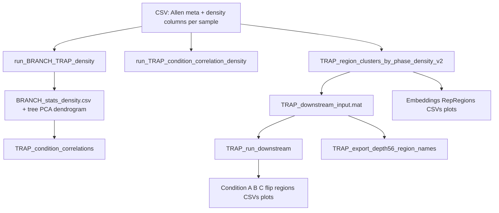

# TRAP pipeline — roadmap & technical reference

This document maps **all MATLAB files**, **data shape**, **workflow**, and **relationships** between scripts.

---

## 1. Inventory of MATLAB files (22 × `.m`)

| File | Role |
|------|------|
| **BRANCH_analysis_TRAP_density.m** | Early BRANCH-style pipeline: loads CSV, bilateral mean by base acronym, per-node ranksum (Active vs Passive), Kruskal–Wallis across phases, FDR via `mafdr`, tree plot, PCA/UMAP, dendrogram, paired sign-rank for 7597. Outputs to local `BRANCH_TRAP_OUTPUT` or similar. |
| **run_BRANCH_TRAP_density.m** | Refined BRANCH on **L + global nodes**, L/R average, **local BH-FDR**, tree, PCA (depth 5–6), optional UMAP, Euclidean dendrogram, paired tests. Primary reference for “standard” BRANCH output next to CSV. |
| **run_BRANCH_TRAP_density2.m** | Same core as above + **pretty tree** (`drawTreePlot_density_pretty`) for q_ActivePassive and q_time; typo risk: Reexposure uses `8060` in one branch (likely should be `8606`). |
| **run_TRAP_condition_correlation_density.m** | Correlation heatmaps: mean vector per **phase** and per **Delivery×Phase** across depth 5–6 regions; saves `.mat` with `C_phase`, `C_combo`. |
| **TRAP_condition_correlations.m** | Uses BRANCH `BRANCH_stats_density.csv` to subset regions (q thresholds), z-scores by region, builds **condition×condition** correlation + hierarchical clustering. |
| **TRAP_condition_correlations3.m** | Variant of condition correlations (`buildSampleGroups`). |
| **TRAP_condition_corr_heatmap_clean.m** | Cleaner heatmap variant. |
| **TRAP_group_correlation_density.m** | Group-level correlation analysis on density. |
| **TRAP_sample_correlation4.m** | Duplicate entry name: defines `TRAP_sample_correlation5` — sample-level correlation (verify which file you use). |
| **TRAP_sample_correlation5.m** | Sample–sample correlation workflow. |
| **TRAP_region_clusters_by_phase_density.m** | **v1:** depth 5–6, k-means per phase (Withdrawal / Reinstatement), embedding, rep regions, density plots. |
| **TRAP_region_clusters_by_phase_density_v2.m** | **Main clustering pipeline:** Allen depth **5/6/7 hierarchy** (prefer depth-7 non-“layer” children when present), `assign_groups_phase`, excludes some samples as `Exclude`, **K-means K=4**, UMAP or PCA, silhouette-based representatives, exports **`TRAP_downstream_input.mat`**. |
| **TRAP_region_clusters_by_phase_density_top40.m** | Like v1 with **top-40** |Active−Passive| style emphasis. |
| **TRAP_region_clusters_by_phase_density_top50.m** | Top-50 variant. |
| **TRAP_region_embedding_and_scatter_all.m** | Global + phase-wise PCA/k-means, cluster scatters, top-40 scatters; depth 5–6. |
| **TRAP_region_embedding_and_top40.m** | Focused embedding + top-40 plots (`bilateralDepth56_leaf`). |
| **TRAP_region_scatter_byCluster_density_allforUMAP.m** | Phase plots aligned with UMAP/cluster logic. |
| **TRAP_regionUMAP_clusterplots.m** | UMAP cluster visualization. |
| **TRAP_topRegion_scatter_density.m** | Fig4-style scatter for top regions by phase. |
| **TRAP_run_downstream.m** | Loads `TRAP_downstream_input.mat` from v2 folder, runs **flip-direction** analysis with **Top 50**. |
| **TRAP_downstream_flip_direction.m** | Standalone flip-direction (older Top-N default); overlaps with logic inside `TRAP_run_downstream.m`. |
| **TRAP_export_depth56_region_names.m** | Reads `TRAP_downstream_input.mat` → CSV of acronym + full name for depth 5–6 list. |

---

## 2. Data input structure

### 2.1 CSV layout

- **Rows:** One per Allen structure row (often **-L** and **-R** separate rows, plus global/root rows).
- **Meta columns (required):**  
  `id`, `name`, `acronym`, `parent_structure_id`, `depth`
- **Data columns:** Any column whose name includes **`density (cells/mm^3)`** except **`AVERAGE density`** (filtered out).
- **Matrix view after load:** `nRegions_full × nSamples` (density).

### 2.2 Processing common to most scripts

1. **Left/right:** Average **-L** and **-R** for the same base region → one value per structure (some scripts keep only left rows then merge R).
2. **Depth:** Many analyses restrict to **depth 5–6** or **v2’s 5/6/7 rule** to avoid ~1700 raw rows and focus on interpretable regions.
3. **Groups:**
   - **Delivery:** Active vs Passive (filename heuristics).
   - **Phase:** Withdrawal / Reinstatement / Reexposure / Unknown / Exclude (v2).

### 2.3 Intermediate binary

- **`TRAP_downstream_input.mat`** (from v2):  
  `NodeSel`, `densLRSel`, `GroupPhase`, `GroupDelivery`, `sampleNames` — used by downstream + export scripts.

---

## 3. Workflow (Mermaid)



**Conceptual stages**

| Stage | Question answered |
|-------|-------------------|
| **BRANCH** | Which atlas nodes differ **Active vs Passive**? Any effect of **phase** (KW)? |
| **Condition correlation** | How similar are **average spatial patterns** across phases or Active/Passive×phase? |
| **Region clustering (v2)** | Within a phase, what **clusters of regions** co-vary across samples? Who are representative regions? |
| **Downstream flip** | Which regions show **opposite Active−Passive sign** in Withdrawal vs Reinstatement? |

---

## 4. Outputs (typical)

| Source | Outputs |
|--------|---------|
| BRANCH | `BRANCH_stats_density.csv`, tree PNGs, `PCA_density.png`, `UMAP_density.png`, `Dendrogram_density.png`, `PairedTests_density.csv` |
| v2 clustering | `RegionEmbedding_*.png`, `RegionDensity_*.png`, `RepRegions_*_Cluster*_fullnames.csv`, **`TRAP_downstream_input.mat`** |
| Downstream | `downstream_flip_direction/ConditionA_full.csv`, `ConditionB_full.csv`, `ConditionC_full.csv`, top-50 z-score CSVs, raw/z-score PNGs |

---

## 5. Advanced analysis & code improvements

### 5.1 Statistics & multiple comparisons

- **Per-region tests:** You test **many regions**; BH-FDR is applied **within** BRANCH stats — good baseline. Consider **hierarchical FDR** or **tree-aware** procedures if you want to control at parent-structure level.
- **Small n:** Ranksum / KW with **very few samples per group** are weak; report **effect sizes** (Cliff’s delta is already there) and **bootstrap CIs**.
- **Paired structure:** Where you have true pairs (e.g. 7597 active vs passive), **region-wise sign-rank** aggregates many tests — consider **mixed models** (region as repeated measure) in R/Python for a single inference.

### 5.2 Clustering & embedding

- **K-means:** K=4 is fixed; use **silhouette sweep**, **gap statistic**, or **stability selection** across resamples.
- **UMAP/PCA:** Clustering on **z-scored** samples per region is consistent; also try **embedding samples** (not regions) to see animal-level structure.
- **Hierarchy:** v2’s depth 5/6/7 rule is documented in code — validate against your **biological question** (e.g. layer-specific vs nuclear).

### 5.3 Flip-direction downstream

- Current rule: **Condition A** = Reinforcement Δ>0 and Withdrawal Δ<0, etc. Add **magnitude thresholds** (e.g. require \|Δ\| > noise floor) to reduce **flip-by-chance** when n is small.
- Optional: **permutation labels** within phase to get an empirical null for “flip” counts.

### 5.4 Engineering

- **Single `trap_config.m`:** `csvPath`, `outRoot`, `K`, FDR q, phase regex table.
- **Sample table:** `samples.csv` with columns `column_name`, `delivery`, `phase` — replace all `contains(nm, …)` logic.
- **Deduplicate:** `BRANCH_analysis_TRAP_density.m` vs `run_BRANCH_TRAP_density.m`; merge `TRAP_downstream_flip_direction.m` with `TRAP_run_downstream.m` (one entry point).
- **Fix:** `run_BRANCH_TRAP_density2.m` line with `8060` for Reexposure; align **Passive** rule (`black` only vs explicit animal IDs) across scripts.
- **Performance:** Vectorized Cliff’s delta or use third-party `cliffdelta`; avoid O(n²) double loops for large samples.
- **Tests:** Save a **tiny synthetic CSV** + smoke test that runs BRANCH on 10 regions × 6 samples.

### 5.5 Extensions (analysis ideas)

- **Partial correlation** of region vectors controlling for **total counts** or **brain-wide mean TRAP**.
- **WGCNA**-style module detection across regions.
- **Enrichment:** map significant regions to **functional ontologies** (behavior, connectivity).
- **Cross-modal:** register to the same pipeline outputs from **cell counts** (not only density) if both exist.

---

## 6. File dependency cheat sheet

```
CSV
 ├── run_BRANCH_TRAP_density.m
 ├── run_TRAP_condition_correlation_density.m
 ├── TRAP_region_clusters_by_phase_density_v2.m
 └── … (all other TRAP_*.m)

BRANCH_stats_density.csv
 └── TRAP_condition_correlations.m

TRAP_downstream_input.mat (from v2)
 ├── TRAP_run_downstream.m
 └── TRAP_export_depth56_region_names.m
```

---

*Last updated to match scripts in `TRAP_pipeline` as of pipeline documentation pass.*
