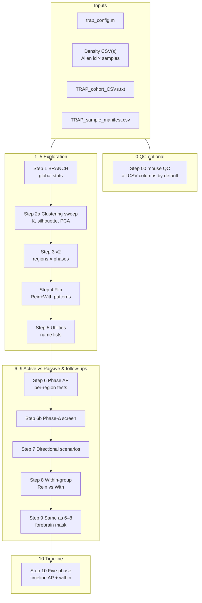
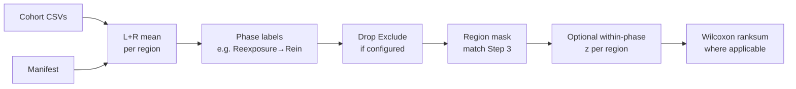

# TRAP_analysis — Whole-brain TRAP density pipeline (MATLAB)

Analysis pipeline for **TRAP whole-brain imaging**: density (cells/mm³) per Allen region, **Active vs Passive**, and **phase**. BRANCH-style stats, PCA/UMAP, k-means, correlations, flip-direction analysis, regionwise statistics, and an optional **five-phase timeline** (Step 10).

**Quick links:** [Roadmap (schematic)](#roadmap-schematic) · [New data checklist](#when-you-have-new-data) · [Steps 0–10](#workflow-steps-0–10-matlab) · [**Step 00 vs 1–11: which CSV columns**](STEP00_AND_PIPELINE_COLUMNS.md) · [What each figure type means](#what-the-figures-mean) · [Methods EN/KR](#methods--statistics-en--kr--추가-문서)

**Publication schematics (Steps 1–3, PNG):** [`docs/steps_1_2_3_publication_schematics/`](docs/steps_1_2_3_publication_schematics/) — raster figures plus [`PHASE_LABELS_AND_Z.txt`](docs/steps_1_2_3_publication_schematics/PHASE_LABELS_AND_Z.txt) (canonical phase labels at load vs optional within-phase z-scoring).

---

## Roadmap (schematic)

High-level order when you run **`init_TRAP_pipeline`** then **`RUN_PIPELINE_ALL`** (optional **`trap_run_mouse_qc_density`** for Step 00 first — see [Workflow](#workflow-steps-0–10-matlab)):



**Step 00 vs Steps 1+ (manifest):** **`trap_run_mouse_qc_density`** (default **`C.mouse_qc_use_all_csv_columns = true`**) pools only columns whose headers contain **`mouse_qc_density_column_header_substring`** (default **`density (cells/mm^3)`**), so **count**, **volume**, and **AVERAGE** columns are not treated as mice. You do **not** need a manifest row per mouse for those density columns. **`TRAP_sample_manifest.csv`** is optional for Step 00; when present, rows match **`cohort_id` + `column_name`** to label delivery / phase / `mouse_id`. **Steps 1–11** use **`trap_load_pooled_density_LR`**, which loads **only** manifest rows with **`include=1`** (partial cohort is fine — no placeholder rows required).

How **rows and columns** flow into statistics (Steps 6–10 share this loader logic):



---

## When you have new data

Do these **before** or **instead of** a full rerun, depending on what changed.

### 1. Add or replace the density CSV(s)

- Copy each file into the **repo root** (next to `trap_config.m`) **or** put them anywhere and reference **absolute paths** in `TRAP_cohort_CSVs.txt`.
- Each CSV must have Allen columns such as **`id`**, **`name`**, **`acronym`**, **`parent_structure_id`**, **`depth`**, plus **one column per mouse/sample** (density).
- **Every cohort CSV must use the same `id` list** as cohort 1 (row order can differ; the code aligns by `id`).

### 2. Files you may need to change

| Situation | What to edit |
|-----------|----------------|
| New filename or location | **`trap_config.m`** → `C.csvPath` (single-file mode), **and/or** **`TRAP_cohort_CSVs.txt`** (one path per line). |
| Second (third, …) cohort file | Add a **new line** to **`TRAP_cohort_CSVs.txt`**. Line index = **`cohort_id`** in the manifest. |
| New mice / new columns | **Steps 1+:** **`TRAP_sample_manifest.csv`** — one row per sample column you want in those steps (`include=1`). **Step 00** can include all CSV columns without new manifest rows (labels `Unknown` until you add rows). |
| New phase labels (e.g. Baseline, During) | Manifest column **`phase`**. If the spelling is nonstandard, extend **`shared/trap_normalize_manifest_phase.m`**. |
| Five-phase timeline (Step 10) | Manifest must include samples for **`phase5_phases`** in **`trap_config.m`** (default: Baseline, During, Post, Withdrawal, Reinstatement) and a **baseline** phase for deltas. Details: **[`STEP10_NEW_DATA_FIVE_PHASE_WORKFLOW.md`](STEP10_NEW_DATA_FIVE_PHASE_WORKFLOW.md)**. |
| Same mice for Step 3 and Steps 6–9 | **`trap_config.m`** → `C.v2_sample_source = 'manifest'`. See **`STEP_CONSISTENCY_3_vs_6_8.md`**. |

### 3. Manifest columns (required for Steps 1–11; optional for Step 00)

For **each** sample column you want in **Steps 1+** (statistics, BRANCH, phase AP, …):

- **`cohort_id`** — which line of `TRAP_cohort_CSVs.txt` (1, 2, …), or `1` if only one CSV.
- **`column_name`** — **exact** header string in that cohort’s CSV.
- **`delivery`** — e.g. `Active`, `Passive`.
- **`phase`** — e.g. `Withdrawal`, `Reinstatement`, `Baseline`, … (normalized; see `trap_normalize_manifest_phase.m`).
- **`include`** — `1` = use in Steps 1+, `0` = skip.

Optional: **`mouse_id`** (for your notes; the pipeline matches data by **`column_name`** + **`cohort_id`**).

**Step 00 (mouse QC)** does **not** require a complete manifest: with the default **`mouse_qc_use_all_csv_columns`**, every numeric density column in each cohort file is used; add manifest rows when you want delivery/phase labels on those mice.

### 4. Run MATLAB

```matlab
cd('...\TRAP_analysis')   % folder that contains init_TRAP_pipeline.m
init_TRAP_pipeline
trap_run_mouse_qc_density   % optional Step 00 — all mice in cohort CSVs by default
RUN_PIPELINE_ALL
```

- **Faster test:** in **`trap_config.m`**, set **`C.runMode = 'quick'`** (fewer permutations / bootstrap off).
- **Plots:** prefer the **MATLAB desktop** app; some **`matlab -batch`** environments skip PNG export.
- **Step 10 only** (after the rest has been run at least once with a valid manifest):

```matlab
trap_run_phase5_timeline_analysis
% Optional forebrain-heavy mask:
% trap_run_phase5_timeline_analysis(struct('phase_AP_row_filter_fn', @trap_AP_filter_forebrain_exclude_fiber_wm))
```

### Steps 12–13 (per-group top-N, universal cluster maps)

**Prerequisites:** run at least through **Step 3 v2** so `TRAP_downstream_input.mat` exists. For Step 13, Step 3 must use the **universal partition** (`C.v2_universal_partition = true` in `trap_config`).

| Goal | MATLAB |
|------|--------|
| **Step 12 only** (top-N regions per group × phase) | `trap_run_step12_per_group_topN` — optional `struct('trap_output_density_variant','calculated_mm3')` or `'allen_mm3'`. |
| **Step 13 only** (PCA, t-SNE, k-sanity, phase trajectories, top representative regions per cluster) | `trap_run_step13_universal_cluster_viz(struct('trap_output_density_variant','calculated_mm3'))` |
| **Full pipeline (Steps 1–13)** for **one** density tree | `RUN_PIPELINE_ALL` or `RUN_PIPELINE_ALL(struct('trap_output_density_variant','calculated_mm3'))` |
| **Both density variants** (separate `TRAP_OUTPUT_allen_mm3` and `TRAP_OUTPUT_calculated_mm3` trees) | `RUN_PIPELINE_ALL_dual_density` |

Always run **`cd(...)`** to the folder that contains **`init_TRAP_pipeline.m`** (e.g. `TRAP_github_sync` or `TRAP_analysis_sync`), then **`init_TRAP_pipeline`** before any step.

More detail: **[`WHEN_YOU_ADD_MICE_EN_KR.md`](WHEN_YOU_ADD_MICE_EN_KR.md)** (EN+KR), **[`DENSITY_CSV_SETUP.txt`](DENSITY_CSV_SETUP.txt)**.

---

## Workflow: Steps 0–10 (MATLAB)

**Step 00** is run manually (`trap_run_mouse_qc_density`). **Steps 1–10** run in order via **`RUN_PIPELINE_ALL.m`** (after **`init_TRAP_pipeline`**).

| Step | What it does | Main outputs under `TRAP_OUTPUT/` (or config paths) |
|------|----------------|-----------------------------------------------------|
| **00** | **Mouse QC** — dendrograms / rank / optional k-means; **default: all numeric columns** per cohort CSV; manifest optional for labels. | **`00_mouse_QC_density/`** |
| **1** | **BRANCH** — whole-brain summaries of Active vs Passive (global / tree / embedding views depending on script). | **`01_BRANCH_tables_and_figures/`** — CSVs + **`figures_described/`** |
| **2a** | **Clustering sweep** — scan **K**, **silhouette**, **stability**, **sample PCA**. | **`02_clustering_sweep/figures_described/`** |
| **3** | **Region clustering v2** — phase-aware clustering; builds **`TRAP_downstream_input.mat`** for Step 4. | **`03_region_clustering_v2/`** (+ RepRegions CSVs, figures) |
| **4** | **Flip / downstream** — regions whose **Reinstatement** and **Withdrawal** Active−Passive pattern meets **Conditions A/B/C** (joint across phases; different question from Step 6). | **`04_flip_downstream/figures_described/`** |
| **5** | **Utilities** — export region name lists (e.g. depth 5–6). | Next to v2 / config paths |
| **6** | **Phase-specific Active vs Passive** — per region, **within Reinstatement** and **within Withdrawal** separately; **Wilcoxon rank-sum**; FDR trees / volcanoes / bar plots. **Always** under **`raw_cells_mm3/`** and **`z_within_phase/`**. | **`06_phase_ActivePassive_FDR/`** (see `trap_config.m` → `phase_AP_root`) |
| **6b** | **Phase-delta screening** — how **\|Δ_Rein − Δ_With\|** ranks regions (exploratory). | Under phase AP / follow-up roots (see console + folder READMEs) |
| **7** | **Directional scenarios** — separate folders for **scenario** contrasts (volcano + directional bar-style summaries). **Dual scale** as Step 6. | **`07_directional_AP_scenarios/`** |
| **8** | **Within-group Rein vs Withdrawal** — for **Active-only** and **Passive-only** mice: regional **mean difference** Rein−With + **Wilcoxon**. **Dual scale** as Step 6. | **`08_within_group_Rein_vs_Withdrawal_delta/`** |
| **9** | **Same analyses as 6–8** on a **forebrain-focused** region set (excludes brainstem + cerebellum per Step 9 mask). **Dual scale** under each `step6_*` / `step7_*` / `step8_*`. | **`09_forebrain_no_brainstem_cerebellum/`** |
| **10** | **Five-phase timeline** — within delivery: means per phase, **Δ vs baseline**, heatmaps / line plots; cross-group: **Active vs Passive within each phase**. **Always** under **`raw_cells_mm3/`** and **`z_within_phase/`** (full duplicate trees). | **`10_five_phase_timeline/`** (`phase5_timeline_root`) |

**Step 4 vs Step 6:** Step 6 is “**one phase at a time**” (A vs P in Rein **or** in With). Step 4 is “**both phases together**” for a **pattern** (e.g. opposite signs). **Top-region lists need not match** — that is expected.

---

## What the figures mean

Most PNGs live in a **`figures_described/`** folder. For many plots there is a **same-base-name `.txt`** file next to the PNG with **methods and interpretation** — read that first.

### Step 1 — BRANCH (`01_…/figures_described/`)

- **Atlas / tree views** — which regions show **strong global** Active−Passive separation or pass FDR-style thresholds (whole matrix context; **not** the same as single-phase Step 6).
- **PCA / UMAP / dendrogram** — **low-dimensional view of samples or regions**; useful for outliers and global structure.
- **Tables (CSV)** — per-region statistics, fold changes, optional bootstrap CIs (`trap_config` → `bootstrap_B`).

### Step 2 — Clustering sweep (`02_…/figures_described/`)

- **Silhouette vs K** — how well a given **K** separates clusters (higher is generally better; used to pick K).
- **Stability heatmap** — how often **pairs of regions** end up in the same cluster across resamples / K (robustness).
- **Sample PCA** — mice as points: do **Active/Passive** or **phase** separate in density space?

### Step 3 — v2 (`03_region_clustering_v2/figures_described/`)

- **Embedding / density heatmaps** — clusters of **regions** with similar TRAP patterns; **representative region** tracks per cluster.
- **Z-score / density panels** — often **within-phase z** per region across mice (matches `phase_AP_z_within_phase` when enabled).
- **`TRAP_downstream_input.mat`** — **no figure**; input to Step 4.

### Step 4 — Flip (`04_…/figures_described/`)

- **Flip summaries** — regions where **Reinstatement (A−P)** and **Withdrawal (A−P)** jointly satisfy a **condition** (magnitude/sign rules); includes **permutation**-style null summaries in CSVs.
- **Bar / ranking figures** — highlight regions with **consistent cross-phase** patterns (again: **not** the Step 6 ranking).

### Steps 6–7 — Phase AP & scenarios

- **Volcano** — x-axis: **mean Active − mean Passive** (or z-scale equivalent); y-axis: **−log10(p)**. Dots = regions; **highlighted** = pass your **raw p** or **FDR** rule (`trap_config`).
- **FDR / significance trees** — Allen hierarchy colored by **significance** or effect direction (whole-brain context).
- **Horizontal bar charts** — **top regions** by effect or **smallest p** among significant (or ranked) set.
- **Four-way / multi-panel plots** — **side-by-side** Active vs Passive structure across **phases** or conditions (exact layout depends on script).
- **Step 7 scenario folders** — same **spirit** as Step 6 but for **predefined directional stories** (see folder READMEs and scenario names).

### Step 8 — Within-group Rein vs With

- **Delta bar plots** — per region: **mean(Rein) − mean(With)** within **Active** or within **Passive**; **Wilcoxon p** across mice in that delivery group.
- **Volcano / ranked lists** — which regions **increase** or **decrease** from Withdrawal to Reinstatement **within** one delivery group.

### Step 9 — Forebrain subset

- **Same figure types as Steps 6–8**, restricted to **forebrain** (excludes cerebellum + brainstem); use when **global brainstem signal** should not dominate.

### Step 10 — Five-phase timeline (`10_five_phase_timeline/`)

- **Two parallel output trees:** **`raw_cells_mm3/`** (cells/mm³) and **`z_within_phase/`** (within-phase z). `phase_AP_z_within_phase` does **not** select one branch for Step 10.
- **Δ vs baseline heatmap** — rows = regions, columns = phases; values = **mean(phase) − mean(baseline)** within **Active** or **Passive** (units match that folder).
- **Row-wise z across phases** — **shape** of change across the timeline (magnitude-invariant); built from that folder’s phase means.
- **Line plots (top-N regions)** — **mean density or mean z** vs phase for the most **variable** regions.
- **Volcano per phase** — **Active vs Passive** **within that phase only** (same statistical idea as Step 6).

---

## Methods & statistics (EN + KR) — 추가 문서

**[`PIPELINE_DATA_STATISTICS_EN_KR.md`](PIPELINE_DATA_STATISTICS_EN_KR.md)** — Mermaid flow, **processing**, **group definitions**, **tests** (Steps 1–9).  
**[`RUN_MATLAB_AND_GITHUB_EN_KR.md`](RUN_MATLAB_AND_GITHUB_EN_KR.md)** — MATLAB run + GitHub push (EN + KR).

**Step 00 vs Steps 1–11 (density columns vs manifest):** [`STEP00_AND_PIPELINE_COLUMNS.md`](STEP00_AND_PIPELINE_COLUMNS.md)

**Step 10 (five-phase):** [`STEP10_NEW_DATA_FIVE_PHASE_WORKFLOW.md`](STEP10_NEW_DATA_FIVE_PHASE_WORKFLOW.md)

**Run order (script index):** [`WORKFLOW.md`](WORKFLOW.md)  
**Where code vs outputs live:** [`FOLDERS_GUIDE.md`](FOLDERS_GUIDE.md)  
**Step 3 vs 6–9 sample alignment:** [`STEP_CONSISTENCY_3_vs_6_8.md`](STEP_CONSISTENCY_3_vs_6_8.md)  
**Technical index:** [`PIPELINE_ROADMAP.md`](PIPELINE_ROADMAP.md)  
**Warnings:** [`WARNINGS_EXPLAINED_EN_KR.md`](WARNINGS_EXPLAINED_EN_KR.md)  
**Output paths (legacy notes):** [`OUTPUT_GUIDE_EN_KR.md`](OUTPUT_GUIDE_EN_KR.md)

---

## Before you run (minimal checklist)

1. **`init_TRAP_pipeline`** once per MATLAB session.
2. **`trap_config.m`** — `csvPath`, outputs, `runMode`, optional `v2_sample_source`, FDR/raw *p*. (Steps 6–10 always write **`raw_cells_mm3/`** and **`z_within_phase/`**; `phase_AP_z_within_phase` is legacy for helpers without an explicit override.)
3. **`TRAP_cohort_CSVs.txt`** — one density CSV path per line (cohort 1, 2, …); same `id` universe across files.
4. **`TRAP_sample_manifest.csv`** — required for **Steps 1+** (`include=1` rows only; partial cohorts are fine). For **Step 00** with default settings, the file can be absent or incomplete — labels fall back to `Unknown` until you add rows.
5. **`MOUSE_COHORT.txt`** — optional human notes.

---

## Folder layout (code in repo)

| Folder | Role |
|--------|------|
| **`shared/`** | Loaders, FDR, export, phase normalization, AP helpers |
| **`Step_01_…` – `Step_05_…`** | BRANCH, correlations, clustering, flip, utilities |
| **`Step_06_phase_AP_contrasts/`** | Steps 6–10 drivers (`trap_run_*`) |

**Generated outputs** — under **`TRAP_OUTPUT/`** as in the step table above; many figures sit in **`figures_described/`** with **paired `.txt`** captions.

---

## Requirements

- MATLAB (Statistics Toolbox)
- Optional: UMAP (`run_umap`)
- Optional: Bioinformatics Toolbox — `BRANCH_analysis_TRAP_density.m` only (`mafdr`)

---

## License

Add a `LICENSE` file if you want open reuse.
