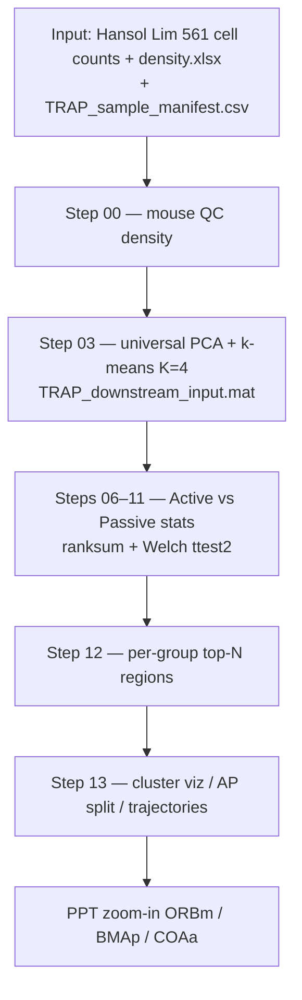

# Biological aim · Workflow · Figures · Code · Meaning

Hansol Lim — whole-brain TRAP (Active vs Passive morphine SA).  
Companion PDF: [`ppt_source/11TRAP_data_ORBm_BMAp_COA_for_next_step33.pdf`](ppt_source/11TRAP_data_ORBm_BMAp_COA_for_next_step33.pdf)

**Figures in this pack = only those used in that final PDF.**  
See [`HOW_FINAL_PDF_WAS_MADE.md`](HOW_FINAL_PDF_WAS_MADE.md) and [`FINAL_PDF_FIGURE_MAP.md`](FINAL_PDF_FIGURE_MAP.md). Do not treat the full Step-13 PNG dump as the final figure set.

---

## 1. Main biological aim

**Primary question**

> Which **brain regions** show the **largest and most consistent Active ≫ Passive** TRAP density difference across morphine phases — and which regions instead show a **Passive-biased** pattern that may track generalized (non-opioid) motivation?

**Design (brief)**

| Element | Definition |
|---------|------------|
| Groups | **Active** (contingent morphine SA) vs **Passive** (yoked infusions) |
| Phases | During → Post → Withdrawal → Reinstatement (re-exposure) |
| Readout | TRAP+ **cell density** (calculated: cells / sample volume mm³), L/R pooled |
| Atlas | Allen Mouse Brain Atlas; Step 3 hierarchy567 → forebrain gray |

**Why this matters biologically**

- Regions that stay **Active ≫ Passive with Passive flat** favor **opioid-related seeking / craving**, not “any seeking.”  
- Regions that are **Passive > Active at Post + Withdrawal** are candidate **generalized-motivation / patient-relevant** targets (Passive ≈ noncontingent exposure).

**Final candidate story (from PPT summary)**

| Finding | Regions | Pattern | Interpretation |
|---------|---------|---------|----------------|
| **A** | **ORBm, BMAp** | Active ≫ Passive across Post / Withdrawal / Reinstatement; Passive flat | Dual-role craving: opioid seeking + negative-affect craving in WD |
| **B** | **COAa** (also LGv, FC numerically) | Passive > Active at Post + Withdrawal | Cue/context + WD state → generalized motivation |

**Funnel used to get there (PPT roadmap)**

```text
~800+ atlas rows
   → Step 3 hierarchy567 (~286)
   → forebrain_no_bs (~138)
   → universal k-means K=4 clusters
   → keep clusters 1 & 4 (A>P at Post & Reinstatement)
   → 7 shortlist regions (ORBm, CA, AId | BMAp, LM, RE, CP)
   → zoom-in → survivors: ORBm + BMAp
   (+ Finding B from cluster 3: COAa)
```

---

## 2. Analysis workflow (step-by-step)



### 2.1 How to run (MATLAB)

```matlab
cd('C:\Users\hsollim\behavior_task\TRAP_analysis_sync');
init_TRAP_pipeline;

% Dual density (Allen + calculated) full pipeline
trap_run_mouse_qc_density(struct('trap_output_density_variant','calculated_mm3'));
RUN_PIPELINE_ALL(struct('trap_output_density_variant','calculated_mm3'));

% Or Step 13 only (needs Step 3 .mat already):
trap_run_step13_universal_cluster_viz(struct('trap_output_density_variant','calculated_mm3'));
```

### 2.2 Code entry points (GitHub ↔ local copy in this pack)

| Step | What it does | GitHub path | Pack copy |
|------|--------------|-------------|-----------|
| Init | Put steps on path | [`init_TRAP_pipeline.m`](https://github.com/limserenahansol/TRAP_analysis/blob/main/init_TRAP_pipeline.m) | [`code/init_TRAP_pipeline.m`](code/init_TRAP_pipeline.m) |
| Full run | Steps 1–13 | [`RUN_PIPELINE_ALL.m`](https://github.com/limserenahansol/TRAP_analysis/blob/main/RUN_PIPELINE_ALL.m) | [`code/RUN_PIPELINE_ALL.m`](code/RUN_PIPELINE_ALL.m) |
| Dual density | Allen + calculated | [`RUN_PIPELINE_ALL_dual_density.m`](https://github.com/limserenahansol/TRAP_analysis/blob/main/RUN_PIPELINE_ALL_dual_density.m) | [`code/RUN_PIPELINE_ALL_dual_density.m`](code/RUN_PIPELINE_ALL_dual_density.m) |
| Step 03 | Universal K=4 clusters | [`TRAP_region_clusters_by_phase_density_v2.m`](https://github.com/limserenahansol/TRAP_analysis/blob/main/Step_03_region_clustering_PCA_kmeans/TRAP_region_clusters_by_phase_density_v2.m) | [`code/Step_03_.../TRAP_region_clusters_by_phase_density_v2.m`](code/Step_03_region_clustering_PCA_kmeans/TRAP_region_clusters_by_phase_density_v2.m) |
| Step 12 | Top-N per group/phase | [`trap_run_step12_per_group_topN.m`](https://github.com/limserenahansol/TRAP_analysis/blob/main/Step_12_per_group_topN/trap_run_step12_per_group_topN.m) | [`code/Step_12_...`](code/Step_12_per_group_topN/trap_run_step12_per_group_topN.m) |
| Step 13 driver | Viz + AP split | [`trap_run_step13_universal_cluster_viz.m`](https://github.com/limserenahansol/TRAP_analysis/blob/main/Step_13_universal_cluster_viz/trap_run_step13_universal_cluster_viz.m) | [`code/Step_13_.../trap_run_step13_universal_cluster_viz.m`](code/Step_13_universal_cluster_viz/trap_run_step13_universal_cluster_viz.m) |
| Step 13 core | Nested loops | [`trap_run_step13_universal_core.m`](https://github.com/limserenahansol/TRAP_analysis/blob/main/Step_13_universal_cluster_viz/trap_run_step13_universal_core.m) | [`code/Step_13_.../trap_run_step13_universal_core.m`](code/Step_13_universal_cluster_viz/trap_run_step13_universal_core.m) |

**Canonical output folder (figures in this pack came from here):**

```text
TRAP_OUTPUT_calculated_mm3/13_universal_cluster_PCA_density/forebrain_no_bs/z_within_phase/
```

---

## 3. PPT figures ↔ code ↔ meaning (final PDF only)

**Authoritative map:** [`FINAL_PDF_FIGURE_MAP.md`](FINAL_PDF_FIGURE_MAP.md)  
**How the deck was built:** [`HOW_FINAL_PDF_WAS_MADE.md`](HOW_FINAL_PDF_WAS_MADE.md)

Final figures were made with Python presentation helpers on top of Step-13 tables — not by dumping every Step-13 PNG:

| Block | Pack folder | Main scripts |
|-------|-------------|--------------|
| Fig1 / Fig3 / Fig4 / Fig5 | `figures/01_pipeline_clustering/` | `trap_region_selection_ppt.py` |
| Finding A ORBm/BMAp | `figures/02_findingA_ORBm_BMAp/` | `trap_region_zoomin.py`, `trap_forMark_figs.py`, paired-slope helpers |
| Finding B COAa | `figures/03_findingB_COAa/` | `trap_fig_cluster3_heatmap.py`, COAa / P>A helpers |
| Schematics | `figures/05_schematics/` | forMark schematic builders |
| Histology | PDF slides 14–16, 19–21, 29–30 only | manual inserts in PPT |

**AI checks (high level)**

- Keep fixed K=4 cluster labels; select clusters 1 & 4 by A>P at Post & Reinstatement.  
- Recover BMAp (c4) and ORBm (c1) shortlists, then **only ORBm/BMAp** as Finding A after zoom-in.  
- Recover **COAa** as Finding B (Passive > Active at Post + WD), not only Active≫Passive.

---

## 4. Region filter stack (apples-to-apples)

| Layer | Code | Approx. n |
|-------|------|-----------|
| Bilateral pool | `trap_load_pooled_density_LR` | ~839 |
| Step 3 hierarchy567 | `TRAP_region_clusters_by_phase_density_v2` / `trap_AP_filter_to_step3_regions` | ~286 |
| Forebrain no BS/fiber | [`trap_AP_filter_forebrain_exclude_fiber_wm.m`](code/shared/trap_AP_filter_forebrain_exclude_fiber_wm.m) | ~138 |
| Scale | within-phase z-score | — |

**Rule:** optional filters (fiber / forebrain) always apply **after** Step 3 — never jump from full atlas to “whole_brain_no_fiber” without Step 3 first.

---

## 5. What an AI agent should reproduce (benchmark rubric)

Use with Neuro-Agent pack: `TRAP_analysis_sync/neuro_agent_trap_submission/rubric_items.md`.

**Must get right**

1. **20 mice**, both cohorts; exclude `HaLi_020326_11`.  
2. Density = **calculated_mm3** (not only Allen mm³).  
3. **Z within phase**, then group means.  
4. **Step 3 K=4 labels** for primary clusters.  
5. Select clusters **1 & 4** for Active craving timeline; cluster **3** for Passive bias.  
6. Shortlist includes **ORBm / BMAp** (Finding A) and **COAa** (Finding B).  
7. Hard k-means = **one label per region** (PCA overlap ≠ dual membership).  
8. Do **not** claim silhouette max = K=4 without checking the CSV.

**Deliverables for an agent run**

- PCA/cluster map or roster  
- Cluster phase A-vs-P summary  
- Cluster 1 and/or 4 AP direction heatmap  
- Short methods paragraph + biological interpretation of A vs B  

---

## 6. Quick links

| Resource | URL / path |
|----------|------------|
| GitHub repo | https://github.com/limserenahansol/TRAP_analysis |
| Neuro-Agent submission | https://github.com/limserenahansol/TRAP_analysis/tree/main/neuro_agent_trap_submission |
| Google Drive (Yiqi package) | https://drive.google.com/drive/folders/1dz61ccn31xe8WoARrZ4WEAEkqKJEvOIW |
| Task spreadsheet | https://docs.google.com/spreadsheets/d/1oecv4-Hxw28f5DtZdB3XSeyQLGDiQnOYhIJFqWs-Y9s/edit |
| Local full outputs | `behavior_task\TRAP_analysis_sync\TRAP_OUTPUT_calculated_mm3\` |
| Chat history (pipeline build) | `Research_Projects\02_TRAP_wholebrain\_chat_logs\cursor_trap_analysis_pipeline_documenta.md` |

---

## 7. One-paragraph abstract (shareable)

We measured whole-brain TRAP+ cell density in Active vs yoked Passive mice across morphine phases. After Allen hierarchy filtering and forebrain restriction (~138 regions), universal k-means (K=4) grouped regions by Active–Passive fingerprints. Clusters 1 and 4 tracked Active craving (A>P at Post and Reinstatement); within them, zoom-in retained **ORBm** and **BMAp** as dual-role craving regions (Active ≫ Passive with Passive flat). Cluster 3 highlighted **COAa** as a Passive-biased, patient-relevant generalized-motivation candidate. MATLAB Steps 03/12/13 implement this funnel; this pack maps each PPT figure to the generating code and reference PNGs for AI benchmarking.
