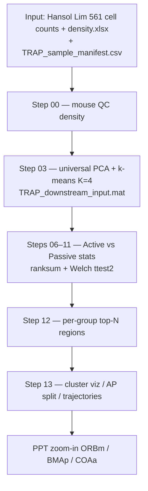
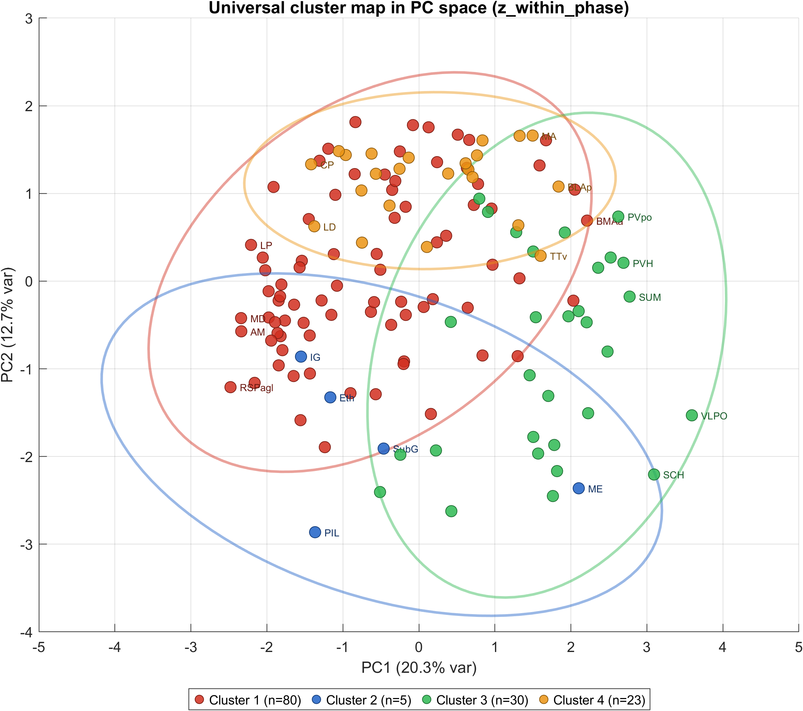
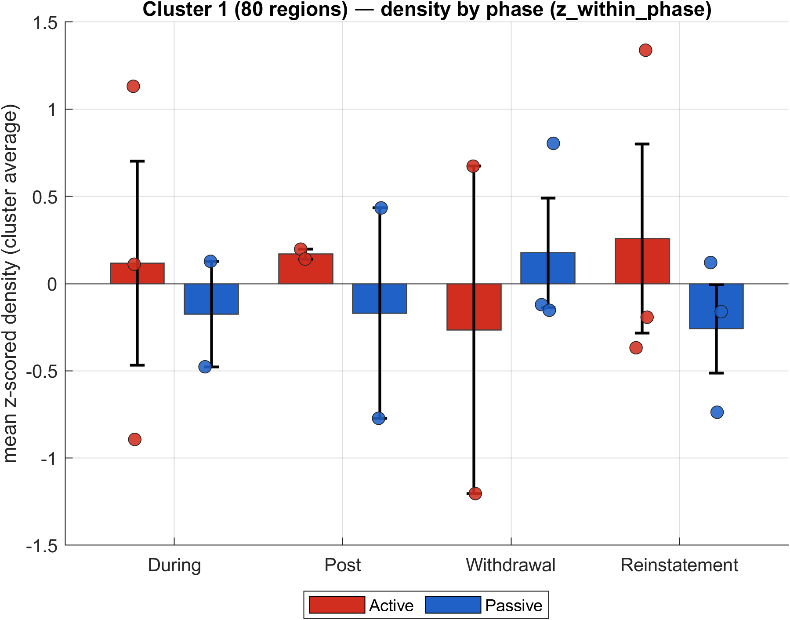
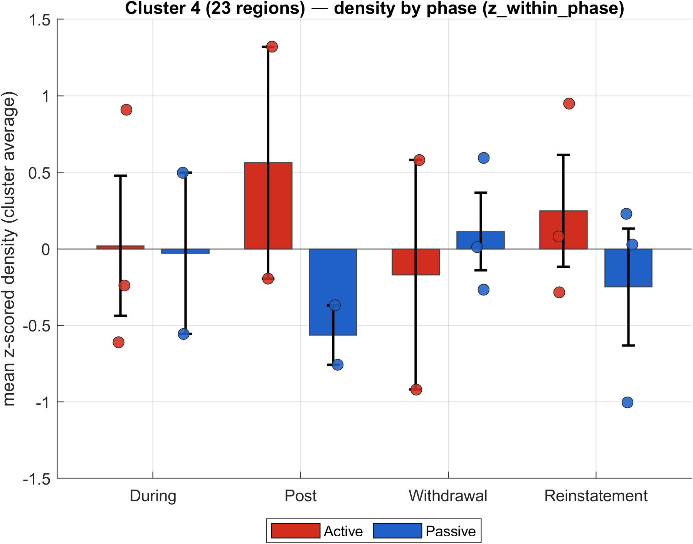
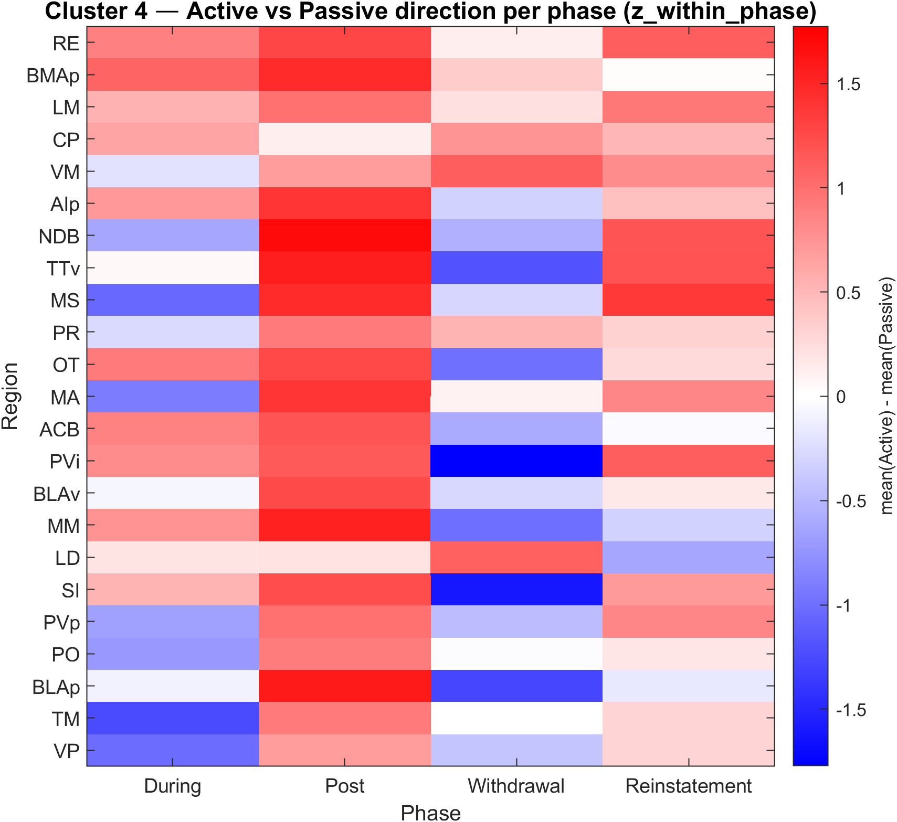
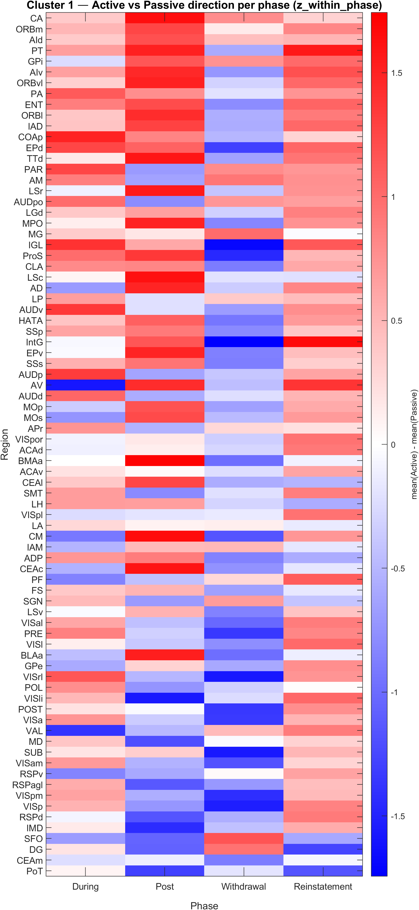
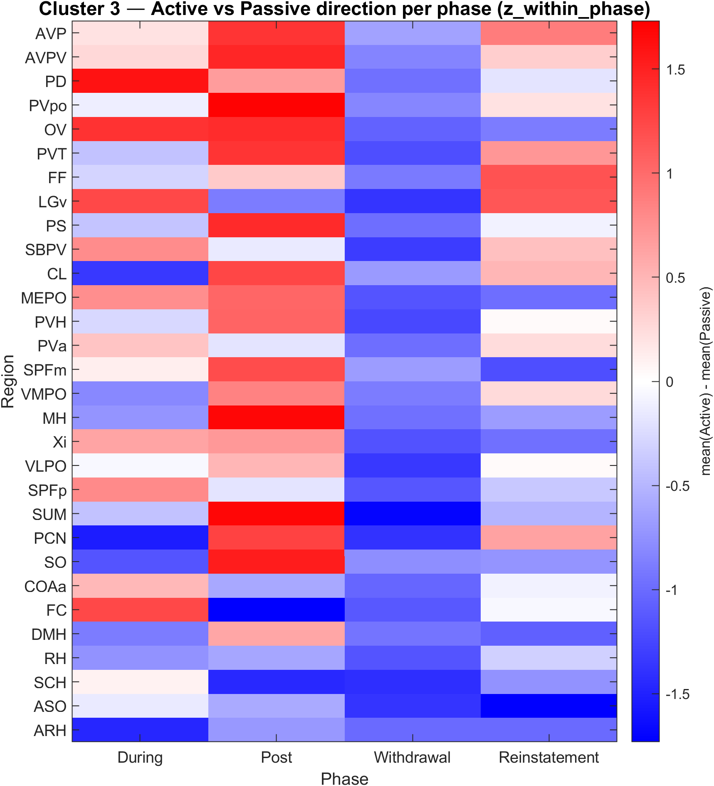

# Biological aim · Workflow · Figures · Code · Meaning

Hansol Lim — whole-brain TRAP (Active vs Passive morphine SA).  
Companion PDF: [`ppt_source/11TRAP_data_ORBm_BMAp_COA_for_next_step33.pdf`](ppt_source/11TRAP_data_ORBm_BMAp_COA_for_next_step33.pdf)

---

## 1. Main biological aim

**Primary question**

> Which **brain regions** show the **largest and most consistent Active ≫ Passive** TRAP density difference across morphine phases — and which regions instead show a **Passive-biased** pattern that may track generalized (non-opioid) motivation?

**Design (brief)**

| Element | Definition |
|---------|------------|
| Groups | **Active** (contingent morphine SA) vs **Passive** (yoked infusions) |
| Phases | During → Post → Withdrawal → Reinstatement (re-exposure) |
| Readout | TRAP+ **cell density** (calculated: cells / sample volume mm³), L/R pooled |
| Atlas | Allen Mouse Brain Atlas; Step 3 hierarchy567 → forebrain gray |

**Why this matters biologically**

- Regions that stay **Active ≫ Passive with Passive flat** favor **opioid-related seeking / craving**, not “any seeking.”  
- Regions that are **Passive > Active at Post + Withdrawal** are candidate **generalized-motivation / patient-relevant** targets (Passive ≈ noncontingent exposure).

**Final candidate story (from PPT summary)**

| Finding | Regions | Pattern | Interpretation |
|---------|---------|---------|----------------|
| **A** | **ORBm, BMAp** | Active ≫ Passive across Post / Withdrawal / Reinstatement; Passive flat | Dual-role craving: opioid seeking + negative-affect craving in WD |
| **B** | **COAa** (also LGv, FC numerically) | Passive > Active at Post + Withdrawal | Cue/context + WD state → generalized motivation |

**Funnel used to get there (PPT roadmap)**

```text
~800+ atlas rows
   → Step 3 hierarchy567 (~286)
   → forebrain_no_bs (~138)
   → universal k-means K=4 clusters
   → keep clusters 1 & 4 (A>P at Post & Reinstatement)
   → 7 shortlist regions (ORBm, CA, AId | BMAp, LM, RE, CP)
   → zoom-in → survivors: ORBm + BMAp
   (+ Finding B from cluster 3: COAa)
```

---

## 2. Analysis workflow (step-by-step)



### 2.1 How to run (MATLAB)

```matlab
cd('C:\Users\hsollim\behavior_task\TRAP_analysis_sync');
init_TRAP_pipeline;

% Dual density (Allen + calculated) full pipeline
trap_run_mouse_qc_density(struct('trap_output_density_variant','calculated_mm3'));
RUN_PIPELINE_ALL(struct('trap_output_density_variant','calculated_mm3'));

% Or Step 13 only (needs Step 3 .mat already):
trap_run_step13_universal_cluster_viz(struct('trap_output_density_variant','calculated_mm3'));
```

### 2.2 Code entry points (GitHub ↔ local copy in this pack)

| Step | What it does | GitHub path | Pack copy |
|------|--------------|-------------|-----------|
| Init | Put steps on path | [`init_TRAP_pipeline.m`](https://github.com/limserenahansol/TRAP_analysis/blob/main/init_TRAP_pipeline.m) | [`code/init_TRAP_pipeline.m`](code/init_TRAP_pipeline.m) |
| Full run | Steps 1–13 | [`RUN_PIPELINE_ALL.m`](https://github.com/limserenahansol/TRAP_analysis/blob/main/RUN_PIPELINE_ALL.m) | [`code/RUN_PIPELINE_ALL.m`](code/RUN_PIPELINE_ALL.m) |
| Dual density | Allen + calculated | [`RUN_PIPELINE_ALL_dual_density.m`](https://github.com/limserenahansol/TRAP_analysis/blob/main/RUN_PIPELINE_ALL_dual_density.m) | [`code/RUN_PIPELINE_ALL_dual_density.m`](code/RUN_PIPELINE_ALL_dual_density.m) |
| Step 03 | Universal K=4 clusters | [`TRAP_region_clusters_by_phase_density_v2.m`](https://github.com/limserenahansol/TRAP_analysis/blob/main/Step_03_region_clustering_PCA_kmeans/TRAP_region_clusters_by_phase_density_v2.m) | [`code/Step_03_.../TRAP_region_clusters_by_phase_density_v2.m`](code/Step_03_region_clustering_PCA_kmeans/TRAP_region_clusters_by_phase_density_v2.m) |
| Step 12 | Top-N per group/phase | [`trap_run_step12_per_group_topN.m`](https://github.com/limserenahansol/TRAP_analysis/blob/main/Step_12_per_group_topN/trap_run_step12_per_group_topN.m) | [`code/Step_12_...`](code/Step_12_per_group_topN/trap_run_step12_per_group_topN.m) |
| Step 13 driver | Viz + AP split | [`trap_run_step13_universal_cluster_viz.m`](https://github.com/limserenahansol/TRAP_analysis/blob/main/Step_13_universal_cluster_viz/trap_run_step13_universal_cluster_viz.m) | [`code/Step_13_.../trap_run_step13_universal_cluster_viz.m`](code/Step_13_universal_cluster_viz/trap_run_step13_universal_cluster_viz.m) |
| Step 13 core | Nested loops | [`trap_run_step13_universal_core.m`](https://github.com/limserenahansol/TRAP_analysis/blob/main/Step_13_universal_cluster_viz/trap_run_step13_universal_core.m) | [`code/Step_13_.../trap_run_step13_universal_core.m`](code/Step_13_universal_cluster_viz/trap_run_step13_universal_core.m) |

**Canonical output folder (figures in this pack came from here):**

```text
TRAP_OUTPUT_calculated_mm3/13_universal_cluster_PCA_density/forebrain_no_bs/z_within_phase/
```

---

## 3. PPT figures ↔ pipeline figures ↔ code ↔ meaning

Convention: **PPT Fig #** matches the PDF page labels; **Pack figure** is the file under `figures/`.

---

### Fig 1 — How clustering was done (PCA map + K choice)

| | |
|--|--|
| **PPT meaning** | 138 forebrain regions in PC space, colored by K=4; PCA is display-only; clustering uses full region profile |
| **Pack figure** |  |
| | Also: [`figures/Fig01b_tSNE_cluster_map.png`](figures/Fig01b_tSNE_cluster_map.png), [`figures/k_evaluation/Fig01c_K_sanity_silhouette_elbow.png`](figures/k_evaluation/Fig01c_K_sanity_silhouette_elbow.png) |
| **MATLAB output** | `01_cluster_map_PC1_PC2.png`, `02_cluster_map_tsne.png`, `k_evaluation/03_k_sanity_silhouette_elbow.png` |
| **Code** | Cluster labels from Step 03 → viz in Step 13: [`trap_cluster_PCA_map.m`](code/shared/trap_cluster_PCA_map.m), [`trap_cluster_tsne_map.m`](code/shared/trap_cluster_tsne_map.m), [`trap_cluster_k_sanity_universal.m`](code/shared/trap_cluster_k_sanity_universal.m) |
| **GitHub** | [`shared/trap_cluster_PCA_map.m`](https://github.com/limserenahansol/TRAP_analysis/blob/main/shared/trap_cluster_PCA_map.m) |
| **Table** | [`figures/02_cluster_region_roster.csv`](figures/02_cluster_region_roster.csv) — region → cluster + PC1/PC2 |

**AI check:** Does the agent keep **fixed Step-3 K=4 labels** for the primary map, and treat silhouette/elbow as **supporting** only?

---

### Fig 3 — Why clusters 1 and 4 were selected

| | |
|--|--|
| **PPT meaning** | Per-phase bars of cluster-mean Active vs Passive. Only **clusters 1 & 4** show A>P at **Post & Reinstatement** (motivation timeline) |
| **Pack figures** |   |
| | Also C2/C3: [`Fig03_Cluster2_...`](figures/Fig03_Cluster2_density_by_phase.png), [`Fig03_Cluster3_...`](figures/Fig03_Cluster3_density_by_phase.png) |
| **Trajectories** | [`figures/phase_trajectory/Fig_trajectory_Active.png`](figures/phase_trajectory/Fig_trajectory_Active.png), [`..._Passive.png`](figures/phase_trajectory/Fig_trajectory_Passive.png) |
| **MATLAB output** | `Cluster{1..4}_density_by_phase.png`, `phase_trajectory/04_trajectory_*.png` |
| **Code** | [`trap_cluster_density_by_phase.m`](code/shared/trap_cluster_density_by_phase.m), [`trap_cluster_trajectory_phase_lines.m`](code/shared/trap_cluster_trajectory_phase_lines.m) |
| **Table** | [`figures/cluster_phase_density_summary.csv`](figures/cluster_phase_density_summary.csv) |

**AI check:** Agent should **select clusters by phase pattern** (A>P at Post & Rein), not by silhouette alone.

---

### Fig 4 — Cluster 4 shortlist (BMAp, LM, RE, CP)

| | |
|--|--|
| **PPT meaning** | Within cluster 4: heatmap of Active−Passive across phases; box regions with A>P in craving phases → BMAp, LM, RE, CP |
| **Pack figure** |  |
| **MATLAB output** | `cluster_AP_split/Cluster4_AP_split/Cluster4_direction_heatmap.png` |
| **Code** | [`trap_cluster_split_by_AP_direction.m`](code/shared/trap_cluster_split_by_AP_direction.m) |
| **CSV** | [`figures/cluster_AP_split/Cluster4_always_Active_gt_Passive_all_phases.csv`](figures/cluster_AP_split/Cluster4_always_Active_gt_Passive_all_phases.csv) |
| **Row sort rule** | Top rows = Active>Passive in **all** phases; then by mean Δ |

**AI check:** Can the agent recover **BMAp** (and peers) from Cluster 4 AP heatmap / always-A>P list?

---

### Fig 5 — Cluster 1 shortlist (ORBm, CA, AId)

| | |
|--|--|
| **PPT meaning** | Within cluster 1: top regions by Post+Reinstatement Active−Passive → ORBm, CA, AId |
| **Pack figure** |  |
| **MATLAB output** | `cluster_AP_split/Cluster1_AP_split/Cluster1_direction_heatmap.png` |
| **Code** | same [`trap_cluster_split_by_AP_direction.m`](code/shared/trap_cluster_split_by_AP_direction.m) |
| **CSV** | [`figures/cluster_AP_split/Cluster1_always_Active_gt_Passive_all_phases.csv`](figures/cluster_AP_split/Cluster1_always_Active_gt_Passive_all_phases.csv) |

**AI check:** Can the agent recover **ORBm** (and peers) from Cluster 1?

---

### Finding A zoom-in — ORBm & BMAp (PPT slides ~10–21)

| | |
|--|--|
| **PPT meaning** | Per-region density **and** cell count across phases; Active peaks Post, dips WD but stays ≫ Passive, rebounds at Rein; Passive flat. Other of the “original 7” fail (AId≈Passive, LM driven by 1 mouse, etc.) |
| **Pipeline support** | Cluster AP heatmaps + roster CSVs above; region layouts: [`figures/cluster_layout/Fig_layout_Post.png`](figures/cluster_layout/Fig_layout_Post.png) |
| **Code** | Layout: [`trap_cluster_region_density_layout.m`](code/shared/trap_cluster_region_density_layout.m); top-N reps: [`trap_cluster_representative_topN_plot.m`](code/shared/trap_cluster_representative_topN_plot.m) |
| **Note for AI benchmark** | Single-region “zoom-in with cell count” panels in the PPT are **assembled in the deck** from cohort spreadsheet columns + pipeline shortlists. The **selection logic** is fully in Steps 03/13; exact ORBm/BMAp multipanel PNGs are presentation-layer. |

---

### Finding B — Cluster 3 / COAa (PPT slides ~23–30)

| | |
|--|--|
| **PPT meaning** | Passive > Active at Post + Withdrawal; COAa best anatomy in cluster 3 (LGv/FC same numeric pattern) |
| **Pack figure** |  |
| **Code** | same AP-split helper for Cluster 3 |
| **AI check** | Agent should identify **Passive-biased** cluster/regions as a **second** story, not only Active≫Passive |

---

### Extra supporting figures (not numbered in PPT but useful for agents)

| Pack file | Meaning | Code |
|-----------|---------|------|
| [`figures/representative_regions/Fig_topN_representatives.png`](figures/representative_regions/Fig_topN_representatives.png) | Top-N regions per cluster (silhouette) | `trap_cluster_representative_topN_plot.m` |
| [`figures/Fig01c` via k_evaluation](figures/k_evaluation/Fig01c_K_sanity_silhouette_elbow.png) | K sanity (silhouette + % variance explained) | `trap_cluster_k_sanity_universal.m` |

---

## 4. Region filter stack (apples-to-apples)

| Layer | Code | Approx. n |
|-------|------|-----------|
| Bilateral pool | `trap_load_pooled_density_LR` | ~839 |
| Step 3 hierarchy567 | `TRAP_region_clusters_by_phase_density_v2` / `trap_AP_filter_to_step3_regions` | ~286 |
| Forebrain no BS/fiber | [`trap_AP_filter_forebrain_exclude_fiber_wm.m`](code/shared/trap_AP_filter_forebrain_exclude_fiber_wm.m) | ~138 |
| Scale | within-phase z-score | — |

**Rule:** optional filters (fiber / forebrain) always apply **after** Step 3 — never jump from full atlas to “whole_brain_no_fiber” without Step 3 first.

---

## 5. What an AI agent should reproduce (benchmark rubric)

Use with Neuro-Agent pack: `TRAP_analysis_sync/neuro_agent_trap_submission/rubric_items.md`.

**Must get right**

1. **20 mice**, both cohorts; exclude `HaLi_020326_11`.  
2. Density = **calculated_mm3** (not only Allen mm³).  
3. **Z within phase**, then group means.  
4. **Step 3 K=4 labels** for primary clusters.  
5. Select clusters **1 & 4** for Active craving timeline; cluster **3** for Passive bias.  
6. Shortlist includes **ORBm / BMAp** (Finding A) and **COAa** (Finding B).  
7. Hard k-means = **one label per region** (PCA overlap ≠ dual membership).  
8. Do **not** claim silhouette max = K=4 without checking the CSV.

**Deliverables for an agent run**

- PCA/cluster map or roster  
- Cluster phase A-vs-P summary  
- Cluster 1 and/or 4 AP direction heatmap  
- Short methods paragraph + biological interpretation of A vs B  

---

## 6. Quick links

| Resource | URL / path |
|----------|------------|
| GitHub repo | https://github.com/limserenahansol/TRAP_analysis |
| Neuro-Agent submission | https://github.com/limserenahansol/TRAP_analysis/tree/main/neuro_agent_trap_submission |
| Google Drive (Yiqi package) | https://drive.google.com/drive/folders/1dz61ccn31xe8WoARrZ4WEAEkqKJEvOIW |
| Task spreadsheet | https://docs.google.com/spreadsheets/d/1oecv4-Hxw28f5DtZdB3XSeyQLGDiQnOYhIJFqWs-Y9s/edit |
| Local full outputs | `behavior_task\TRAP_analysis_sync\TRAP_OUTPUT_calculated_mm3\` |
| Chat history (pipeline build) | `Research_Projects\02_TRAP_wholebrain\_chat_logs\cursor_trap_analysis_pipeline_documenta.md` |

---

## 7. One-paragraph abstract (shareable)

We measured whole-brain TRAP+ cell density in Active vs yoked Passive mice across morphine phases. After Allen hierarchy filtering and forebrain restriction (~138 regions), universal k-means (K=4) grouped regions by Active–Passive fingerprints. Clusters 1 and 4 tracked Active craving (A>P at Post and Reinstatement); within them, zoom-in retained **ORBm** and **BMAp** as dual-role craving regions (Active ≫ Passive with Passive flat). Cluster 3 highlighted **COAa** as a Passive-biased, patient-relevant generalized-motivation candidate. MATLAB Steps 03/12/13 implement this funnel; this pack maps each PPT figure to the generating code and reference PNGs for AI benchmarking.
